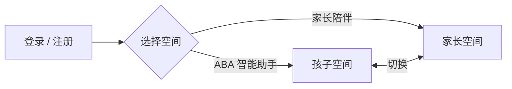

# 家长使用说明 · 星星家庭

> 写给家长的话 — 这一份是「产品里到底有什么」的小地图。

---

## 目录

- [打开应用会看到什么](#入口)
- [ABA 智能助手](#aba-助手)
  - [首页](#aba-首页)
  - [孩子](#aba-孩子)
  - [训练](#aba-训练)
  - [进展](#aba-进展)
  - [我的](#aba-我的)
- [家长陪伴](#家长陪伴)
  - [陪伴](#陪伴)
  - [情绪](#情绪)
  - [成长 ACT](#成长)
  - [日记](#日记)
  - [知识库](#知识库)
- [两个空间怎么切换](#切换)

---

## 打开应用会看到什么

登录页会有**两个入口**让你选：

- **ABA 智能助手** — 给孩子做评估、训练、记录进展
- **家长陪伴** — 给你自己的情绪、成长、日记

两个空间用同一个账号，**不用重新登录**就能来回切换。

---

## ABA 智能助手

底部从左到右 5 个标签：**首页 · 孩子 · 训练 · 进展 · 我的**

### 首页

进来第一屏是「**有什么我可以帮你的？**」。

- **问 AI**：直接描述场景，按"发送"。系统会从 12 分册知识库（326 块）里找答案，并标注来源。
- **问专家**：在可选项里选一位专家，之后消息都由他回复。
- 右上角「导出」「清空」可以保存或重置对话。

### 孩子

这一页解决三件事：**有谁 / 在哪 / 怎么开始**。

- **当前孩子卡片**：**孩子有头像** — 系统首次进入会自动生成一张卡通头像（可换）；照片式头像支持上传 / 移除 / 重新生成（三个 mini 按钮）。「+」可加新孩子。
- **多孩子切换**：超过一个孩子时会出现横向胶囊。
- **能力状态**：进入「孩子」页后看到的"目前状态"区域，按领域（语言、社交、认知、运动……）显示百分比，下方有趋势标签（进步中 / 稳定 / 需关注）。
- **导入病例**：可以上传 PDF / Word / TXT，或直接粘贴文本。AI 会自动分析并更新孩子状态。
- **能力评估**：39 题，5 阶段递进，覆盖全部 210 个训练技能。  
  每题三选：**还不会 / 有时 / 经常**。  
  进度本地保存，可断网续答。  
  提交后**自动生成训练任务**。

### 训练

「**今天，专注一件小事**」 — 短时、高频、在成功时结束。

- **当前任务**：按分类分组显示，可上下排序；可标记为「每日」。
- **添加新任务**：在管理模式下打开，可搜索训练模板、按领域浏览、从大量训练项里挑，也可以手写自定义。
- **图片卡**：127 类 / 6569 张教学图片。训练时自动匹配，也能单独浏览（左右翻、随机）。
- **开始训练**：5 个按钮记录每一次反应：
  - **I** 独立
  - **V** 语言辅助
  - **M** 示范
  - **P** 身体辅助
  - **E** 错误
- 屏幕中央是**独立正确率 %**，底部是「撤销上一条 / 结束并保存」。

### 进展

「**每一点积累，都有意义**」。

- 三块统计卡片：**训练天数 / 完成训练数 / 平均独立率**
- **最近训练**：时间线，每条记录技能名 + 独立正确率
- **AI 训练报告**：点「生成本周报告」后，AI 会生成结构化总结，包含「进步 / 稳定 / 回退」标签 + 下一步建议；可下载 PDF。

### 我的

- 头像 + 账号名
- **进入家长陪伴**（一键切换到家长空间）
- 退出登录

---

## 家长陪伴

底部 5 个标签：**陪伴 · 情绪 · 成长 · 日记 · 知识库**

### 陪伴

一个**安全、温和、不评判**的空间。

- 顶部快捷情绪按钮（平静 / 焦虑 / 疲惫 / 悲伤）
- 对话区是基于 ACT 框架的成长支持，写下此刻想说的话，按"发送"。

### 情绪

不只是"今天心情好不好"，而是**多维记录**。

- **本周强度 / 已记录天数 / 常见情绪** 三块概览
- **情绪族**（6 组）：稳定 / 正向活力 / 警觉与不安 / 低落与疲惫 / 压力与愤怒 / 迷茫。可多选。
- **强度** 1-5（几乎没感觉 / 轻微 / 中等 / 较强 / 非常强烈）
- **触发场景**（12 项）：孩子行为、家庭琐事、工作、夫妻关系、家人期待、训练过程、社交场合、睡眠不足、自我要求、经济压力、健康担忧、时间不够
- **身体感受**（12 项）：肩膀紧、心跳快、胸口闷、胃部不适、手心出汗……
- **应对方式**：选填，写一句「做了什么 / 想做什么 / 没做什么但注意到」
- 下方有**近 7 天强度趋势条**、**最近 14 条记录**。

### 成长（ACT）

带着一个问题，按你自己的节奏走完 6 步：**觉察 → 接纳 → 解离 → 当下 → 价值 → 行动**。

- 顶部写下"现在困扰你的是什么？"（例：晚上孩子又哭闹，我忍不住对他吼了）
- 按下「开始六步」，依次出现 6 个引导，每步一个具体问题（例：此刻，这件事让你感受到什么？……今天可以做的一件 2 分钟小事是什么？）
- 6 步都做完，回到原问题记录：缓解了吗 / 还在 / 写一句此刻的状态
- 过往问题按时间倒序保存，可再来一次六步

### 日记

顶部两个问题作为引导：

- 今天有没有一个你想记录下来的瞬间？
- 如果有朋友处在你今天的位置，你会对他说什么？

写完按「保存今日反思」。历史按时间倒序显示。

### 知识库

9 个分类的内容，按需点开：

- 育儿压力
- 自我关怀
- 情绪
- 关系
- 正念
- 方法与认知
- 健康与睡眠
- 习惯养成
- 工作与生活平衡

每篇文章带「阅读时间」标记，可收藏路径。

---

## 两个空间怎么切换

- 在 **ABA 智能助手** → 「我的」 → 「进入家长陪伴」
- 在 **家长陪伴** → 顶部「← ABA 智能助手」

切换不需要重新登录。

---

## 一句话记住

> 孩子的事，交给 **ABA 智能助手**；  
> 自己的事，交给 **家长陪伴**。  
> 两个空间用同一个账号，随时切换。
