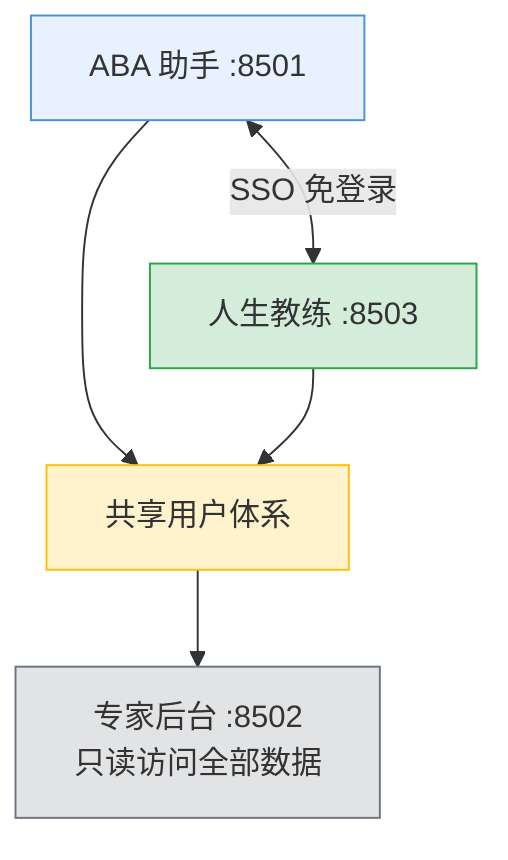

# ABA 智能助手 — 产品结构文档

> 版本：v1.4 | 更新日期：2026-06-05

---

## 一、产品概述

**ABA 智能助手**是一款面向自闭症儿童家长的 AI 辅助工具，帮助家庭在日常陪伴中科学地进行 ABA（应用行为分析）干预训练，同时照顾好家长自身的心理健康。

### 产品定位

| 维度 | 说明 |
|------|------|
| **核心价值** | 专业知识普及 + 个性化训练支持 + 降低干预门槛 |
| **目标用户** | 自闭症儿童家长（尤其是刚开始接触 ABA 的家庭） |
| **使用场景** | 家庭日常陪伴干预 |
| **产品调性** | 温暖、专业、可信赖 |

### 核心设计原则

| 原则 | 说明 |
|------|------|
| **准确性第一** | 专业知识必须准确，绝不误导家长 |
| **轻量化设计** | 不增加使用负担，操作简单便捷 |
| **专业强度支撑** | 有足够的 ABA 专业知识作为后盾 |
| **家长自主权** | 给家长选择权和决策权，不替代专业治疗师 |

---

## 二、产品线

本系统包含两条互补的产品线，三个独立应用：

### 2.1 ABA 智能助手（端口 8501）

面向**孩子**的 ABA 训练支持工具。

| 功能模块 | 说明 |
|----------|------|
| **AI 问答** | 基于 ABA 专业知识库（12 个分册、326 个文档块）的智能问答 |
| **孩子档案** | 多个孩子档案管理，基本信息、诊断、偏好 |
| **能力评估** | 39 道递进题，5 阶段全面评估，覆盖全部 210 个训练技能 |
| **任务清单** | 评估后自动生成个性化训练任务，按领域优先级排序 |
| **训练记录** | ABA 按试次记录数据（正确/错误/辅助），全程追踪 |
| **图片卡片** | 127 个类别 / 6569 张教学图片卡，支持配对和全屏浏览 |
| **进展看板** | 数据可视化跟踪训练进展 |
| **报告生成** | AI 生成训练进展报告 |

### 2.2 人生教练（端口 8503）

面向**家长本人**的心理成长教练。

| 功能模块 | 说明 |
|----------|------|
| **教练对话** | 基于 ACT（接纳与承诺疗法）框架的 AI 对话 |
| **成长项目** | 5 个阶段的成长议题：觉察→接纳→连接→行动→整合 |
| **情绪追踪** | 每日情绪记录，趋势可视化 |
| **反思日记** | 引导式反思写作 |
| **知识库** | 34 篇正念/情绪/关系/自我关怀文章 |
| **报告** | 每周情绪 + 成长综合报告 |

### 2.3 专家后台（端口 8502）

面向**运营/专家**的数据管理工具（仅 SSH 隧道访问）。

| 功能模块 | 说明 |
|----------|------|
| **用户列表** | 全部用户概览，支持按用户查看完整数据 |
| **数据导出** | 一键导出用户数据（md + JSON） |
| **跨用户检索** | 向量相似度检索，找相似案例 |
| **AI 草稿** | 7 章节省份案报告草稿生成 |

### 2.4 模块间关系

---

## 三、知识库

### 3.1 知识库结构

共计 12 个分册，326 个文档块，通过 ChromaDB 向量化支持语义检索。

| 分册 | 内容 |
|------|------|
| 01_安全边界与禁忌 | 绝对不能说的话、高风险场景处理 |
| 02_核心概念定义 | ABA 基本概念、术语解释 |
| 03_常见问题 | 家长高频问题与专业回答 |
| 04_循证方法介绍 | DTT、PRT、NET 等循证方法 |
| 05_活动方案库 | 家庭可操作的活动方案 |
| 06_场景化干预方案库 | 超市、餐厅等具体场景的干预策略 |
| 07_美国儿科医学参考 | 儿科医学资源索引 |
| 08_分步训练项目清单 | 分步训练项目总览 |
| 基础_课程指南 | 基础级别训练步骤 |
| 初级_课程指南 | 初级级别训练步骤 |
| 中级_课程指南 | 中级级别训练步骤 |
| 高级_课程指南 | 高级级别训练步骤 |

### 3.2 检索机制

- 本地 MiniLM 模型做 Embedding，无需外部 API
- ChromaDB 本地向量存储
- 12 个文档 → 326 个语义块 → 按 query 语义检索 top-K 结果注入 LLM 上下文

---

## 四、版本历史

| 版本 | 日期 | 变更 |
|------|------|------|
| v1.0.0 | 2026-05-16 | 首版交付（联网装依赖 + PyInstaller 探索） |
| v1.1.0 | 2026-05-17 | 绿色包：嵌入 Python + 离线 wheel；客户机器零依赖 |
| v1.2.0 | 2026-05-30 | ABA 训练闭环：技能树/入门评估/训练任务/试次录入/干预建议/进展报告 |
| v1.2.1 | 2026-05-30 | 图片卡（6569 张）+ 自动预渲染缓存 |
| v1.3.0 | 2026-05-31 | 人生教练模块：ACT 对话引擎/知识库/SSO 免登录互跳 |
| **v1.4.0** | **2026-06-05** | **评估系统 v3 全覆盖版：39 题 5 阶段递进，覆盖全部 210 技能；评估→任务自动生成闭环** |

---

## 五、交付方式

| 方式 | 适用场景 | 说明 |
|------|---------|------|
| **Docker 公网部署** | 家长通过浏览器直接访问 | 当前生产方案，`deploy/deploy.sh` 一键部署 |
| **绿色包** | 单机离线使用 | macOS / Windows zip 包，双击启动 |

### 绿色包

- `release/build_release.sh` 一键构建
- 产物：`ABA智能助手_macOS_vX.X.X.zip` (~300MB) / `ABA智能助手_Windows_vX.X.X.zip` (~280MB)
- 内置嵌入式 Python + 全部 wheel 依赖，客户无需装 Python

---

## 六、项目完成度

| 维度 | 完成度 | 备注 |
|------|--------|------|
| AI 问答核心 | 100% | 多模型/知识库/安全/报告 |
| ABA 训练闭环 | 95% | 课程/评估/任务/训练/看板全上线，缺单元测试 |
| 人生教练 | 90% | ACT 引擎/知识库/SSO 上线，内容待补充 |
| 专家后台 | 90% | 数据访问/导出/草稿上线 |
| 知识库内容 | 100% | 12 分册，326 文档块 |
| 图片卡素材 | 100% | 127 类别 / 6569 张 |
| 单元/集成测试 | 0% | 依赖功能性手测 |
| 代码签名 | 0% | 非进店分发可绕过 |

---

*最后更新：2026-06-05*
