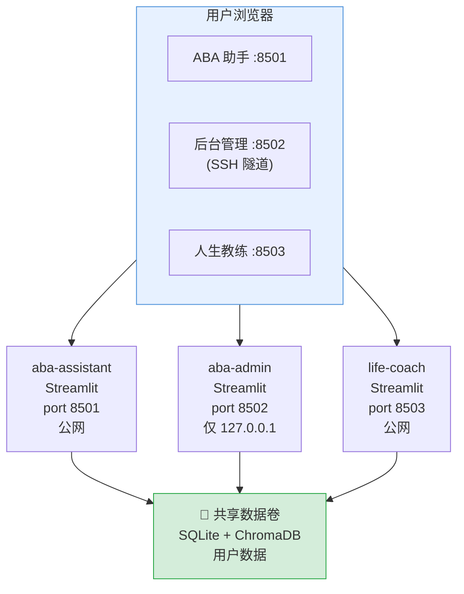

# ABA 智能助手 — 技术文档

> 版本：v1.4 | 更新日期：2026-06-05

---

## 一、系统架构

本系统采用 **Streamlit + SQLite + ChromaDB** 轻量架构，通过 Docker Compose 部署为 3 个独立服务。



### 技术选型

| 组件 | 选择 | 说明 |
|------|------|------|
| 前端框架 | Streamlit | 纯 Python，无需前后端分离 |
| 数据库 | SQLite | 单文件、免运维、足够支撑千级用户 |
| 向量库 | ChromaDB (本地) | 嵌入式向量检索，无需外部服务 |
| AI 模型 | MiniMax / OpenAI / Anthropic / 豆包 | 四家可切换，统一 API 封装 |
| 容器化 | Docker Compose | 3 个 service，共享数据卷 |
| 图片处理 | PyMuPDF (fitz) | PDF→PNG 预渲染缓存，dpi=150 |

### 容器端口映射

| 容器 | 端口 | 访问方式 |
|------|------|---------|
| `aba-assistant` | `0.0.0.0:8501` | 公网直连（家长用） |
| `aba-admin` | `127.0.0.1:8502` | 仅 SSH 隧道（运营用） |
| `life-coach` | `0.0.0.0:8503` | 公网直连（家长用） |

---

## 二、代码结构

```mermaid
flowchart LR
    subgraph root["src/MVP_web/"]
        direction LR
        subgraph apps["入口"]
            P1["app_prototype.py<br/>ABA 助手 :8501"]
            P2["life_coach_app.py<br/>人生教练 :8503"]
            P3["admin_app.py<br/>后台管理 :8502"]
            P4["report_generator.py<br/>报告生成"]
        end

        subgraph core["core/ 核心层"]
            C1["config.py<br/>全局配置"]
            C2["deep_memory.py<br/>数据层"]
            C3["deep_memory_extended.py<br/>孩子档案"]
            C4["safety.py<br/>安全检查"]
        end

        subgraph ai["ai/ AI 引擎"]
            A1["agent.py<br/>对话生成"]
            A2["knowledge_base.py<br/>ChromaDB 检索"]
            A3["build_image_cards.py<br/>图片卡渲染"]
            A4["ai_report_generator.py<br/>报告生成"]
        end

        subgraph coach["coach/ 教练"]
            CH1["coach_engine.py<br/>ACT 框架"]
            CH2["coach_content.py<br/>知识库 34 篇"]
            CH3["coach_styles.py<br/>样式"]
        end

        subgraph train["training/ 训练"]
            T1["flashcards.py<br/>PyMuPDF 渲染"]
            T2["training_data.py<br/>训练数据"]
        end

        subgraph utils["utils/ 工具"]
            U1["curriculum.py<br/>210 技能"]
            U2["assessment.py<br/>39 题评估"]
            U3["task_generator.py"]
            U4["charts.py / intervention.py"]
            U5["ui_styles.py / budget_guard.py"]
        end

        subgraph adm["admin/ 后台"]
            D1["data_access.py"]
            D2["exporter.py"]
            D3["similarity.py"]
            D4["draft.py / llm.py"]
        end

        subgraph data["data/ 运行时"]
            DT1["users/<br/>memory.db"]
            DT2["vectors/<br/>ChromaDB"]
            DT3["flashcard_cache/"]
        end
    end

    apps ~~~ core ~~~ ai ~~~ coach ~~~ train ~~~ utils ~~~ adm ~~~ data

    style apps fill:#FFF3CD,stroke:#FFC107
    style core fill:#E7F1FF,stroke:#4A90D9
    style ai fill:#D4EDDA,stroke:#28A745
    style coach fill:#F8D7DA,stroke:#DC3545
    style train fill:#E8DAEF,stroke:#8E44AD
    style utils fill:#D1ECF1,stroke:#17A2B8
    style adm fill:#E2E3E5,stroke:#6C757D
    style data fill:#D5F5E3,stroke:#27AE60
```



---

## 三、核心模块说明

### 3.1 数据层 (`core/deep_memory.py`)

- 用户注册/登录（密码哈希，SHA-256 + salt）
- SQLite 数据持久化
- 按 `user_id` 严格隔离用户数据
- 对话历史、孩子档案、进展记录、报告
- 存储配额管理（500MB/用户）
- GDPR 合规（数据导出/删除/儿童保护）

**主要数据表**：

| 表名 | 用途 |
|------|------|
| `users` | 用户账户 |
| `children` | 孩子档案（支持软删除） |
| `conversations` | 对话历史 |
| `progress_logs` | 进展记录 |
| `reports` | 历史报告 |
| `tasks` | 训练任务清单 |
| `training_sessions` | 训练记录 |
| `extracted_corpus` | AI 提取语料 |
| `user_quotas` | 存储配额 |
| `milestones` | 重要里程碑（永久保留） |

### 3.2 AI 引擎 (`ai/agent.py`)

```
用户问题 → 知识库检索(ChromaDB) → 网络搜索(可选) → LLM 生成回答
                                                         ↓
                                                   流式输出(SSE)
```

- 对话历史注入上下文（最近 10 轮）
- 安全检查拦截高风险内容（自伤/自杀等）
- 多模型切换：MiniMax / OpenAI / Claude / 豆包
- 本地语义检索（MiniLM Embedding，无需外部 API）

### 3.3 教练引擎 (`coach/coach_engine.py`)

- ACT（接纳与承诺疗法）框架
- 三级响应：安全分流 → LLM 对话 → 脚本兜底
- 情绪检测（积极/焦虑/抑郁/绝望）
- 成长阶段评估（5 阶段）
- 风险评估（自伤/自杀/攻击）

### 3.4 训练模块 (`training/flashcards.py`)

- 127 个图片类别 / 6569 张 PDF 卡片
- PyMuPDF 渲染 PDF → PNG 缓存（dpi=150）
- 预渲染脚本：`python utils/prerender_flashcards.py`
- 三个视图：缩略图浏览 / 全屏卡片 / 配对练习

### 3.5 后台模块 (`admin/`)

| 模块 | 职责 | 是否写主库 |
|------|------|-----------|
| `data_access.py` | 按 user_id 过滤的只读查询 | 否 |
| `exporter.py` | 用户数据 → md + JSON 导出 | 只写 exports/ |
| `similarity.py` | 跨用户向量索引 + 检索 | 只写 admin_vectors/ |
| `draft.py` | 专家视角 AI 草稿（7 章节） | 只写 drafts/ |
| `llm.py` | LLM 客户端封装 | 否 |

---

## 四、数据管理策略

### 4.1 数据分类与保留

| 类别 | 内容 | 保留期 |
|------|------|--------|
| **P0 高价值** | 孩子档案、进展报告、评估结果、成长里程碑 | 永久 |
| **P1 重要** | 对话摘要、每周报告、反思日记、成长项目 | 12 个月 |
| **P2 普通** | 原始对话、训练数据、情绪日志、教练对话原始记录 | 3 个月 |
| **P3 冗余** | 已提取的原始对话、缓存、收藏/已读文章记录 | 即时清理 |

### 4.2 存储配额

- 每用户 500MB（ABA + 教练共享）
- 配额 80% 触发提醒
- 支持一键清理 + 手动选择性清理
- 自动清理：超期对话 → AI 摘要压缩 → 删除原始

### 4.3 人生教练数据

教练数据存储在 `data/users/<user_id>/coach_data.json`，与 ABA 共用用户体系。

| 字段 | 保留期 | 说明 |
|------|--------|------|
| `growth_tasks_done` | 永久 | 成长任务完成记录 |
| `emotion_tasks_done` | 永久 | 情绪练习完成记录 |
| `growth_projects` | 12 个月 | 成长项目（压缩后保留里程碑） |
| `journal_entries` | 12 个月 | 反思日记（超期保留月度精华） |
| `mood_log` | 3 个月 | 情绪日志 |
| `coach_messages` | 3 个月（最近 100 条） | 教练对话 |

### 4.4 对话压缩

```
超过 3 个月的对话触发压缩：
原始对话(2000字) → AI 摘要(200字) + 删除原始文本
存储: ~25KB/条 → ~0.3KB/条（压缩率 ~99%）
```

---

## 五、部署架构

### 5.1 服务器要求

- Ubuntu 22.04 / Debian 12
- 2 核 4G+ 内存
- Docker + Docker Compose V2
- 公网端口：8501、8503
- 腾讯云安全组开放对应端口

### 5.2 Docker Compose 服务

```yaml
services:
  aba-assistant:    # 主应用，公网 8501
  aba-admin:       # 后台，仅 127.0.0.1:8502
  life-coach:      # 教练，公网 8503
```

三个服务共享数据卷：
- `~/AI_codex/deploy/data/users/` → SQLite + ChromaDB
- `~/AI_codex/docs/知识库/` → 知识库文档（只读）
- `~/AI_codex/src/aba/图片/` → 训练图片素材（只读）

### 5.3 用户认证体系

三个应用共享同一用户体系：
- 注册一次，全模块通用
- ABA 助手 ↔ 人生教练通过 SSO Token 免登录互跳
- Token 使用 HMAC 签名，按用户名防冒充

### 5.4 日常运维

```bash
# 部署
bash deploy/deploy.sh                  # 全量部署
bash deploy/deploy.sh main             # 仅主应用
bash deploy/deploy.sh admin            # 仅后台

# SSH 隧道访问后台
bash deploy/tunnel.sh                  # → http://127.0.0.1:8502

# 备份
tar -czf backup-$(date +%F).tar.gz deploy/data/  # 可排除 flashcard_cache/
```

---

## 六、环境变量

```bash
# AI 模型（四选一或多配）
MINIMAX_API_KEY=sk-xxx
MINIMAX_BASE_URL=https://api.minimax.io/v1
# OPENAI_API_KEY=sk-xxx
# ANTHROPIC_API_KEY=sk-xxx
# DOUBAO_API_KEY=sk-xxx

# Embedding（向量检索，本地 MiniLM 默认免配）
EMBEDDING_API_KEY=sk-xxx    # 可选

# 教练 SSO
COACH_SSO_SECRET=your-secret-key        # 两个 service 必须一致
LIFE_COACH_URL=http://170.106.143.145:8503
ABA_APP_URL=http://170.106.143.145:8501

# 后台
ABA_ADMIN_PASSWORD=your-strong-password

# 路径
USER_DATA_PATH=./data
```

---

## 七、能力评估技术说明

`utils/assessment.py` 实现 39 道递进式评估题，覆盖全部 210 个训练技能：

- **自动关联课程**：题目中的 `skill_ids` 从 `curriculum.py` 的 `SKILLS` 列表按 `domain + level` 自动注入，写课程文件后评估自动同步
- **递进评分**：答"是"=该层级技能视为已掌握 → 下一题；答"否"=该层级及更高层级全部加入训练推荐
- **任务生成**：评估完成后一键生成全量训练任务清单

---

## 八、课程体系

`utils/curriculum.py` 定义 210 个技能，分布如下：

| 领域 | Level 1 | Level 2 | Level 3 | Level 4 | Level 5 | 合计 |
|------|---------|---------|---------|---------|---------|------|
| 参与技能 | 5 | 6 | 2 | - | - | 13 |
| 模仿技能 | 3 | 4 | 2 | - | - | 9 |
| 视觉空间 | 4 | 7 | 11 | 8 | 4 | 34 |
| 语言技能 | 8 | 16 | 38 | 9 | 2 | 73 |
| 游戏技能 | 2 | 3 | 5 | - | - | 10 |
| 社交技能 | 4 | 5 | 2 | 3 | 4 | 18 |
| 情绪调节 | 2 | 4 | 3 | 1 | 3 | 13 |
| 学业前 | 3 | 4 | 8 | 1 | 8 | 24 |
| 自理技能 | 5 | 4 | 1 | 1 | 5 | 16 |
| **合计** | **36** | **53** | **72** | **23** | **26** | **210** |

---

*最后更新：2026-06-05*
