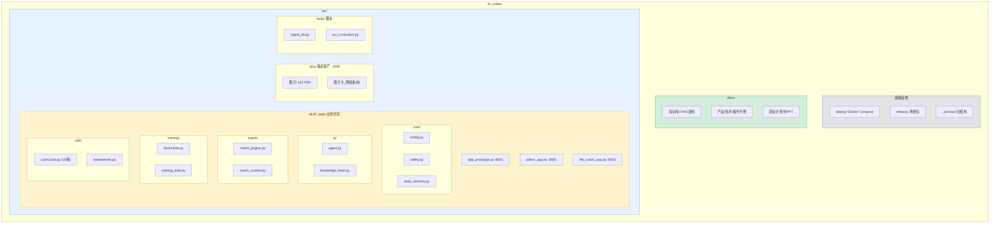

# AI_codex（星星家庭）项目重建说明书

> 本文件的目的：如果要**从零重新生成本项目**，这份描述应当足以让一个工程师/AI 重建出功能等价、架构合理的系统。它记录的是**意图、架构决策、踩过的坑**，而不是逐行代码。截至 2026-06-08 的状态快照。

---

## 0. 一句话定义

面向**自闭症儿童家庭**的本地化 Streamlit 产品，包含两条**互补**用户线：

1. **ABA 智能助手**（面向*孩子*的干预）——AI 问答 + ABA 训练记录闭环。
2. **生活教练**（面向*家长本人*的心理支持）——基于 ACT（接纳与承诺疗法）的成长陪伴。

护城河不是通用聊天，而是 **122 个技能课程树 / 9 大领域评估 / 试次级（trial-level）数据闭环 + 真实分步训练步骤**。

---

## 1. 三个独立 Streamlit 应用

| 应用 | 文件 | 端口 | 面向 | 职责 |
|---|---|---|---|---|
| ABA 智能助手 | `src/MVP_web/app_prototype.py` (~2500 行) | 8501 | 孩子/家长操作 | 主产品：AI 问答、评估、任务、试次记录、进展看板、报告、闪卡 |
| 专家后台 | `src/MVP_web/admin_app.py` (~520 行) | 8502 | 运营/督导专家 | 查看用户记忆数据、相似度分析、导出、人工草稿审核 |
| 生活教练 | `src/MVP_web/life_coach_app.py` (~2230 行) | 8503 | 家长本人 | ACT 心理陪伴：对话、情绪追踪、议题模板、日志、报告 |

三者**共享同一份用户体系与数据目录**（`src/MVP_web/data/`）。生活教练与主应用通过统一登录校验（避免 8503 单独暴露时被冒名），互相跳转用 `LIFE_COACH_URL` / `ABA_APP_URL` 环境变量配置公网地址。

---

## 2. 目录结构（重构后的目标形态）

---

## 3. 智能层与 RAG（核心架构）

### 3.1 LLM
- 默认模型 **MiniMax**（`core/config.py` 的 `AI_MODELS`，`DEFAULT_MODEL="minimax"`）。
- key 走环境变量 `MINIMAX_API_KEY`，端点 `api.minimaxi.com/v1`，模型 `MiniMax-M2.7`（**推理模型**，引擎需 `_strip_reasoning` 剥离 `<think>` 块）。
- **关键约束**：key 必须是 `sk-cp-` 开头（海螺包月有效）；`sk-api-` 那种 API 开放平台 key 会报 `insufficient_balance(1008)`。
- 无 key / 调用失败 → 自动降级到脚本兜底，应用不崩。

### 3.2 RAG / Embedding（双模式，自动切换）
- **本地模式（默认，无需 key、可离线）**：chromadb 内置 DefaultEmbeddingFunction（MiniLM + onnxruntime），collection = `aba_knowledge_local_v1`（余弦，384 维）。
- **远程 API 模式**：设了 `EMBEDDING_API_KEY` 时用，collection = `aba_knowledge_semantic_v2`，两者隔离。
- ⚠️ **MiniMax 的 key 不能用于 OpenAI embeddings 接口**（返回空）。
- 召回阈值 `RETRIEVAL_SCORE_THRESHOLD = 0.35`。
- 向量库路径 `VECTOR_DB_PATH`：本地默认 `data/chromadb`，生产用 `ABA_VECTOR_DB_PATH` 覆盖到镜像内独立路径（不落用户 volume，避免多进程读写冲突）。
- 当前索引规模：**345 块**（知识库 markdown + 四本书课程指南全文）。

### 3.3 安全层（两个产品都先过安全）
- `core/safety.py`：危机词、禁忌边界。生活教练额外加家长语境危机词（如「带孩子一起走」）。
- 生活教练引擎链：**安全分流 → ACT 人格 LLM → 脚本兜底**。

---

## 4. 内容资产：技能树与分步训练（护城河）

- **SKILLS 主表**（`utils/curriculum.py`）共约 210 条技能，分 9 大领域。
- 其中 **88 条「分步训练」新技能**来自三本新书（初级/中级/高级），由「卡片类别名」自动生成（`curriculum_extra*.py`），难度 level 3/4/5，**不会**混进起点推荐（`get_starter_skills` 上限 level≤3），但可手动选用。
- **真实分步骤**（`curriculum_steps_data.py`）：四本书课程指南是扫描件，经 OCR 提取 → **89/89 卡片类别都有步骤、88/88 新技能挂上步骤**。
- **闪卡**：122 个 PDF 卡片类别 + 6 网络素材类别 = 128；12 个为嵌套结构（类别/子集/子集.pdf），`flashcards.py` 的 `_category_pdfs()`+`_locate_page()` 跨多 PDF 累计编页，对调用方透明。

---

## 5. 已知的坑（重建时务必避免）

1. **Agent 必须接 knowledge_base**：重构时曾漏传 `knowledge_base` 给 `ABAAgent`，导致「书完全没接上」的回归。启动时建一次 KB 缓存进 `session_state` 并传给 agent，不在 app 内重建。`smoke_test.py` 已加守护（向量后端可用 + agent 必须接 KB）。
2. **报告污染任务清单**：早期借 tasks 表存报告（category=报告）→ pending 任务被污染，需过滤。
3. **闪卡嵌套结构**：新书 12 类是 类别/子集/子集.pdf，必须支持跨 PDF 累计编页。
4. **扫描件 OCR 配方**（`ocr_curriculum.py`）：
   - PyMuPDF 渲染 **DPI 400 → 二值化 → 左右两栏切分各自 OCR(psm6) → 拼接**。两栏切分是关键，否则左右栏逐行交错、程序↔步骤错乱。
   - Bash 沙箱重定向 TMPDIR，tesseract 读不到 /tmp → 临时 PNG 必须写到项目目录内，且 OCR 命令要 `dangerouslyDisableSandbox`。
   - pytesseract 有 stderr 解码 bug → 改用 subprocess 直调 tesseract。
   - 需 `brew install tesseract tesseract-lang`（含 chi_sim）。
   - OCR 错字用 `build_curriculum_steps.py` 的 `CORRECTIONS` 字典清洗（当前 52 条）。更高精度可上 PaddleOCR。
5. **孩子年龄**：档案只有 birth_date，自动生成任务时别写死 4 岁，用 `_child_age_years` 按出生日期算。
6. **prompt 键名兼容**：`child_diagnosis` 与调用方 `diagnosis` 需兼容两者。

---

## 6. 部署（Docker 路线，服务器可出网）

- **索引在镜像构建时预建**：Dockerfile 设 `ENV ABA_VECTOR_DB_PATH=/app/vectordb_index` 后 `RUN python src/tools/ingest_kb.py`，顺带把 MiniLM 烤进镜像层（运行时不联网）。
- Dockerfile **只 COPY** `src/MVP_web` + `src/tools` + `docs/知识库`，**不 COPY** `src/aba/`（3.5GB）。
- 根目录 `.dockerignore` 把构建上下文从 3.6GB 压到 ~13MB。
- `docker-compose.yml` 三处挂载用 `../docs/知识库`（注意不是 `../知识库`）。
- `requirements.txt` 必须含 `onnxruntime / openai / requests`（onnxruntime 虽由 chromadb 间接带，仍显式列出）。
- `deploy.sh` 同步 `src/tools` + `docs/知识库`，并把 `.dockerignore` 放到构建上下文根。
- 验证基线：两 app health 200，`smoke_test.py` 7 项全过，检索命中正常。

依赖见 `src/MVP_web/requirements.txt`：streamlit / langchain(+openai,community) / chromadb / onnxruntime / anthropic / openai / requests / python-dotenv / plotly / pandas / numpy / pymupdf / pillow / extra-streamlit-components。

---

## 7. 重建检查清单（成功标准）

- [ ] 三个 app 各自能起（8501/8502/8503），health 200。
- [ ] 主应用问答能检索到知识库内容（RAG 接通，非空召回）。
- [ ] `ingest_kb.py` 能从 `docs/知识库/` 重建索引（加书=丢文件再跑）。
- [ ] SKILLS ~210 条、89/89 卡片类别有分步骤、起点推荐只出 level≤3。
- [ ] 闪卡扁平 + 嵌套类别都能正确翻页。
- [ ] 无 LLM key 时自动降级脚本兜底、不崩。
- [ ] 生活教练安全分流对家长危机词生效。
- [ ] `smoke_test.py` 全过（含「agent 必须接 KB」「向量后端可用」两道守护）。
- [ ] Docker 构建上下文 ~13MB、镜像内预建索引、运行时不联网。

---

> 备注：本项目**非 git 仓库**（无版本兜底），重构前结构保留在 `_archive/`。资产 `src/aba/` 约 2GB，单独管理、不进镜像。
</content>
</invoke>
